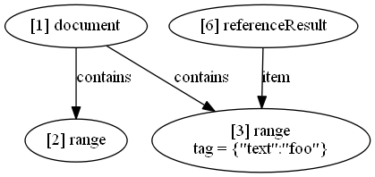

# lsif-util

Scripts to help [LSIF](https://github.com/Microsoft/language-server-protocol/blob/master/indexFormat/specification.md) developers.

## Installation

``` bash
npm install -g lsif-util
```

## Usage

``` bash
lsif-util [validate|visualize] [file] --inputFormat [line|json] [--stdin] [filters]
```

| Option        | Description                                    | Default |
|---------------|------------------------------------------------|---------|
| --inputFormat | Specify input format (choices: "line", "json") | line    |
| --stdin       | Read from standard input                       | false   |

You can use the `--stdin` flag to **pipe LSIF output**:
``` bash
lsif-tsc -p .\tsconfig.json --stdout | lsif-util validate --stdin
```

### Validation

Returns whether the LSIF input file is **syntatically** valid or not.

Verifies the following:

* Vertex properties are correct
* Edge properties are correct
* Vertices are emitted before connecting edges
* Vertices are used in at least one edge (except metadata)

### Visualization

| Option            | Default     | Description                                             |
|-------------------|-------------|---------------------------------------------------------|
| --distance        | 1           | Max distance between any vertex and the filtered input  |

Outputs a [DOT](https://graphviz.gitlab.io/_pages/doc/info/lang.html) graph.

You can either visualize it online using [Viz.js](http://viz-js.com/) or install [Graphviz](http://graphviz.org/) and pipe it to the DOT tool:

``` bash
lsif-util visualize .\example\line.json --distance 2 | dot -Tpng -o image.png
```



### Filters

Filters can help you narrow down what you want to validate/visualize. You can filter by some of the most common properties in LSIF. Different values should be separated by **space**. The "regex" filter is a special case that only accepts one value.

| Property   | Node        | Example                |
|------------|-------------|------------------------|
| --id       | Vertex/Edge | 1 2 3                  |
| --inV      | Edge        | 1 2 3                  |
| --outV     | Edge        | 1 2 3                  |
| --type     | Vertex/Edge | vertex edge            |
| --label    | Vertex/Edge | project range item     |
| --property | Edge        | references definitions |
| --regex    | Vertex/Edge | foo                    |

Validating outgoing edges from vertices 1, 2 or 3:
``` bash
lsif-util validate .\example\line.json --outV 1 2 3
```

Visualizing ranges that have "foo" somewhere in them:
``` bash
lsif-util visualize .\example\line.json --label range --regex foo
```
